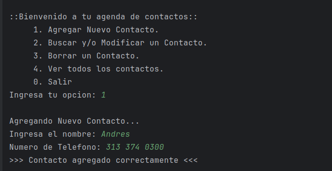
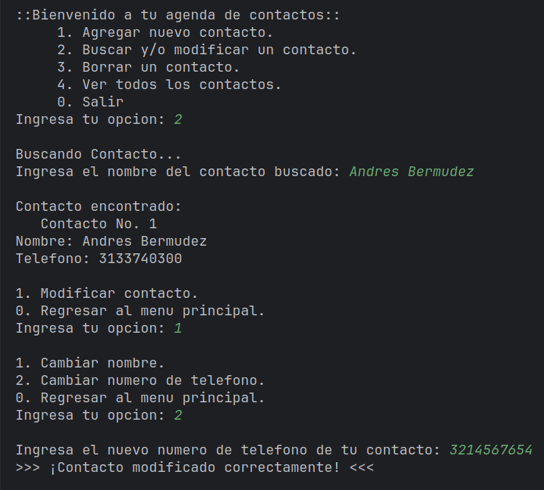
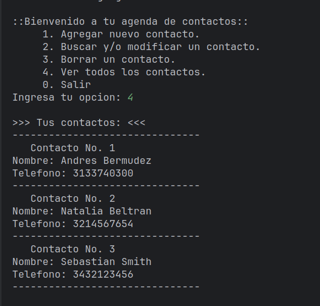

# AGENDA DE CONTACTOS

Inicio de la aplicación:

## Descripción: 
Este proyecto es una aplicación de consola para gestionar una
agenda de contactos, desarrollada en Java, utilizando estructuras
de datos y principios de programación orientada a objetos, la
aplicación incluye validación de datos para garantizar que los 
datos ingresados por el usuario sean correctos, válidos y estén
completos.

### Funciones de la aplicación:
    - Agregar Contactos.
    - Buscar o modificar un contacto.
    - Borrar un contacto.
    - Ver todos los contactos.
 

- Modificación de un contacto:
  

  
- Listado de contactos agregados:

## Objetivos del proyecto:

1. Poner en practica los conocimientos adquiridos en los cursos sobre
programación orientada a objetos con Java:
    
    - Abstracción.
    - Herencia.
    - Encapsulamiento.
    - Polimorfismo.
    - Clases y Objetos.
    - Clases abstractas e interfaces.
    - Principio de modularidad.
    - Constructores.
    - Variables y métodos estáticos.
    - Sobre escritura de métodos.
    - Getters y Setters.
    - Palabras reservadas de Java.
    - Funcionamiento de la memoria en Java(Stack, Heap).
    - Garbage Collector.
    - Manejo de errores.
    - Entre otros...
       
2. Utilizar estructuras de datos, comprender su aplicación en 
proyectos reales, y entender el comportamiento de los elementos
almacenados en estas estructuras, así como manipularlos mediante
los métodos proporcionados por el JDK.
 
3. Crear un CRUD.
    
4. Mejorar mi lógica de programación.

## ¿Como usar el programa?

1. Descarga los archivos en tu equipo.

#### Para ejecutarlo utilizando un IDE:
Abre la carpeta desde tu IDE preferido y corre el programa directamente
desde la clase que contiene el metodo "main", la clase se llama Main.

### Para ejecutarlo sin utilizar un IDE:
1. Abre una terminal en tu equipo.
2. Dirígete a la ruta ./out/production/AgendaContactos
3. Escribe lo siguiente en tu terminal: java Main
 
Ya puedes hacer uso del programa :).
 
Nota: Recuerda tener Java instalado en tu equipo.

